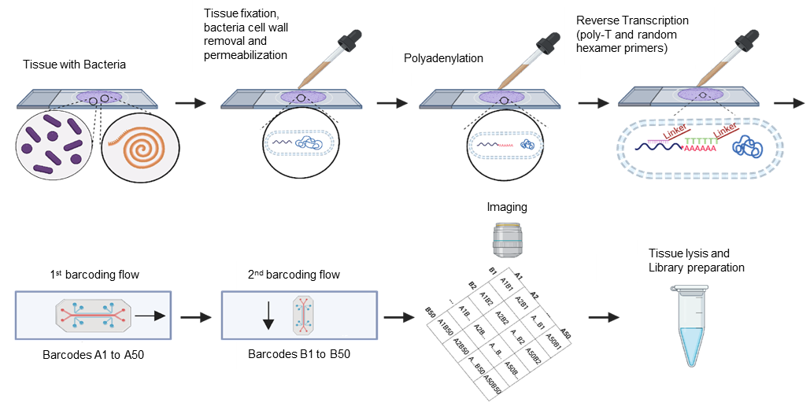

# microDBiT: Spatial Microbiome Sequencing

  

**microDBiT** is a microfluidic-based spatial transcriptomics platform that enables simultaneous, high-resolution profiling of host and microbial RNAs—including both mRNA and rRNA—within the same tissue section.

Unlike conventional spatial transcriptomics methods that focus exclusively on eukaryotic transcripts, microDBiT integrates:
- Optimized microfluidic barcoding chemistry
- Tissue handling protocols designed to preserve microbial RNAs  
- Compatibility with small and low-abundance bacterial populations

This technology opens new avenues for studying host-microbiome interactions at spatial resolution across complex tissues.

---

## 🔬 Key Features
- Spatial mapping of both host and bacterial gene expression  
- Retention and detection of microbial RNA (including rRNA)  
- Compatible with complex and low-biomass microbiota  
- Designed for tissue sections including gut, bladder, and more

---

## 📁 Repository Contents

- `python/` — Scripts and notebooks used in the original data analysis pipeline  
- `images/` — Figures and diagrams used in publications or slides

---

## 📬 Contact
For questions or collaborations, please contact **Yang Liu, Ph.D.** (Assistant Professor, Yale School of Medicine)  